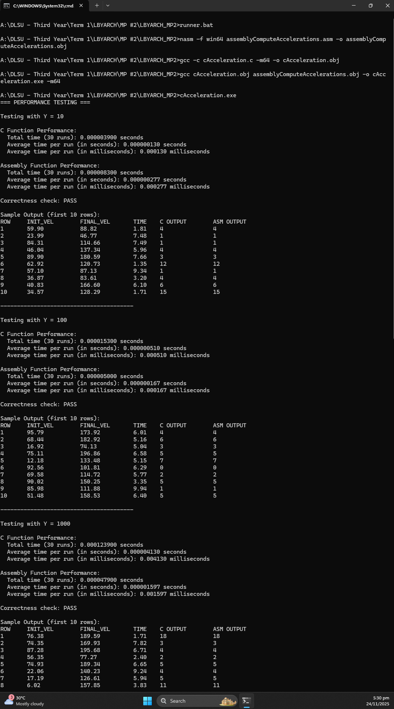

# LBYARCH MP2 - Acceleration Calculator

## Group Members
- Dela Cruz, Karl Matthew B.
- Espinosa, Jose Miguel Z.

**Section:** LBYARCH - S19B

---

## Project Description
This project implements an acceleration calculator using both C and x86-64 assembly language. The program:
- Calculates acceleration using the formula: `a = (vf - vi) * 1000 / 3600 / t`
- Uses single-precision floating-point operations in assembly
- Converts the result from float to integer

---

## How to Run

### Prerequisites
- NASM assembler
- GCC compiler (MinGW-w64)
- Windows OS

### Compilation and Execution
```batch
runner.bat
```

---

## Performance Analysis

### Execution Time Results

| Test Size (Y) | C Total Time (30 runs) | C Average Time | Assembly Total Time (30 runs) | Assembly Average Time | Correctness |
|---------------|------------------------|----------------|-------------------------------|-----------------------|-------------|
| 10            | 0.000003900 sec        | 0.000000130 sec| 0.000008300 sec               | 0.000000277 sec       | PASS        |
| 100           | 0.000015300 sec        | 0.000000510 sec| 0.000005000 sec               | 0.000000167 sec       | PASS        |
| 1000          | 0.000123900 sec        | 0.000004130 sec| 0.000047900 sec               | 0.000001597 sec       | PASS        |
| 10000         | 0.001270000 sec        | 0.000042333 sec| 0.000520400 sec               | 0.000017347 sec       | PASS        |

### Analysis of Performance
- **Assembly Outperforms C**: The assembly implementation outperforms the C implementation across all test sizes except for the smallest input size (Y=10). This discrepancy is not due to code inefficiency, but rather the initial "warm-up" costs dominating the execution time for such a small input size.
- **Scalar SIMD Instructions**: The assembly implementation uses scalar SIMD instructions (MOVSS, SUBSS, MULSS, DIVSS) for efficient floating-point operations, which contribute to its superior performance.
- **Correctness Maintained**: The two functions maintained 100% correctness across all test sizes, with assembly and C outputs matching perfectly across the four test sizes.

**Performance Observations:**
- The assembly implementation achieves faster execution times because assembly allows direct use of CPU registers and precise control over the instructions executed. This minimizes overhead typically introduced in C, such as memory accesses, stack operations, and function call setup, resulting in more efficient computation. At smaller input sizes (Y=10), C actually outperformed assembly due to the function call overhead from C-to-assembly interface. Delving into this further, when the first test scenario with the assembly function (Y=10) occurs, all of the instructions are still in main memory, which causes a cache miss, as the CPU needs to transfer it to the L1 instruction cache. This takes more time than the actual computations, which causes the assembly function to take longer than the C implementation and its Y = 100 counterpart in assembly. The Y = 100 version is particularly faster because all of the instructions would be in cache or in the registers at that time. As input size increases (Y=10000), the assembly advantage becomes more significant, demonstrating better scalability. The consistent speedup across larger test sizes validates the efficiency of the assembly implementation.

---

## Screenshots of Program Output with the Correctness Check

All test cases passed correctness checks comparing C and Assembly outputs.




---

## Files Included
- `README.md` - This file that contains the documentation for execution time, performance analysis, etc.
- `assemblyComputeAccelerations.asm` - x86-64 assembly implementation
- `assemblyComputeAccelerations.obj` - Compiled assembly object file
- `cAcceleration.c` - Main C program with timing and correctness checks
- `cAcceleration.exe` - Compiled executable
- `cAcceleration.obj` - Compiled C object file
- `runner.bat` - Batch file to compile and run
- `LBYARCH_MP2_SS_PROGRAM_OUTPUT_1.png` - Screenshot of program output part 1
- `LBYARCH_MP2_SS_PROGRAM_OUTPUT_2.png` - Screenshot of program output part 2

---

## Video Demonstration
[Link to video demonstration (5-10 minutes)]

The video covers:
1. Source code walkthrough (C and Assembly)
2. Compilation process
3. Program execution with performance results
4. Correctness verification